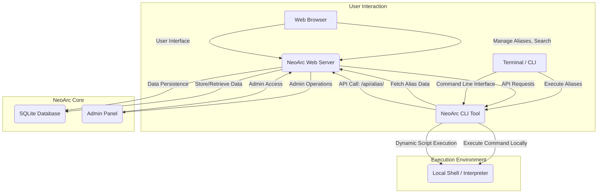

# NeoArc System Architecture

NeoArc operates as a client-server system designed to provide a centralized "Execution Grid" for command aliases. The architecture is divided into two main components: the **Web Server (The Matrix)**, built with Python Flask, and the **CLI Tool (The Client)**, developed in Golang.

## High-Level Overview

The NeoArc system facilitates the storage and remote execution of various script types. Users interact with the web server to manage their aliases and discover public ones. The CLI tool then communicates with the server's API to fetch and execute these aliases directly on the user's local machine.

## Component Breakdown

### 1. NeoArc Web Server (The Matrix)
The server acts as the central hub for alias management, user authentication, and data storage.

*   **Frontend:** A modern, "Liquid Glass" UI built with HTML5, TailwindCSS, and Jinja2 templating. It handles user registration, login, profile management, alias creation/editing, and global search.
*   **Backend:** Powered by Python Flask, it manages:
    *   **User Authentication:** Secure registration and login, session management.
    *   **Alias Management:** CRUD operations for aliases (Create, Read, Update, Delete).
    *   **Database Interaction:** Uses SQLite3 for persistent storage of user and alias data.
    *   **API Endpoints:** Provides a RESTful API for the CLI tool to fetch alias commands.
    *   **Admin Panel:** A dedicated interface for super administrators to manage users and aliases.

### 2. NeoArc CLI Tool (The Client)
The CLI tool is a lightweight, cross-platform binary responsible for fetching and executing aliases.

*   **Configuration:** Stores the NeoArc server URL locally.
*   **API Communication:** Makes HTTP GET requests to the server's `/api/alias/<alias_name>` endpoint to retrieve command details.
*   **Polyglot Execution:** Dynamically creates temporary script files and executes them using the appropriate interpreter (Bash, PowerShell, CMD, Python, Go) based on the `exec_type` provided by the server.
*   **Cross-Platform Compatibility:** Written in Go, it compiles into a single binary for Windows, Linux, macOS, and Android (Termux).

### 3. SQLite Database
A local SQLite database (`neoarc.db`) is used by the Flask server to store all application data, including:
*   User accounts (username, email, password hash, profile picture, block status).
*   Alias definitions (name, command, execution type, associated user).

## Data Flow

1.  **User creates alias:** A user logs into the Web Server, navigates to their dashboard, and creates a new alias, specifying its name, command, and execution type. This data is stored in the SQLite database.
2.  **CLI configures server:** The user configures their CLI tool with the NeoArc Web Server's URL using `neoarc config <server-url>`. This URL is saved locally in a `config.json` file.
3.  **CLI requests alias:** When the user runs `neoarc <alias_name>` in their terminal, the CLI tool constructs an HTTP GET request to `http://<server-url>/api/alias/<alias_name>`.
4.  **Server responds:** The Web Server queries its SQLite database for the requested alias. If found, it returns the alias's command and execution type as a JSON response.
5.  **CLI executes command:** The CLI tool receives the JSON response, creates a temporary script file with the command, and executes it using the appropriate local interpreter (e.g., `bash`, `powershell`, `python`, `go run`).

This architecture ensures a clear separation of concerns, with the server handling data management and the client focusing solely on secure, efficient remote execution.

Written by [Neorwc](https://github.com/rkriad585/neorwc-cli), Created by RK Riad Khan