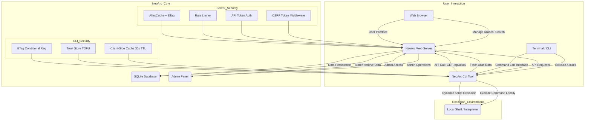

# NeoArc System Architecture

NeoArc operates as a client-server system designed to provide a centralized "Execution Grid" for command aliases. The architecture is divided into two main components: the **Web Server (The Matrix)**, built with Python Flask, and the **CLI Tool (The Client)**, developed in Golang.

## High-Level Overview

The NeoArc system facilitates the storage and remote execution of various script types. Users interact with the web server to manage their aliases and discover public ones. The CLI tool then communicates with the server's API to fetch and execute these aliases directly on the user's local machine.

## Component Breakdown

### 1. NeoArc Web Server (The Matrix)

The server acts as the central hub for alias management, user authentication, and data storage.

- **Frontend:** A modern, "Liquid Glass" UI built with HTML5, TailwindCSS, and Jinja2 templating. It handles user registration, login, profile management, alias creation/editing, and global search.
- **Backend:** Powered by Python Flask with a Blueprint-based route organization:
    - **auth_routes.py** -- Registration, login, logout, session management.
    - **alias_routes.py** -- CRUD operations for user aliases (Create, Read, Update, Delete).
    - **api_routes.py** -- RESTful API endpoints consumed by the CLI tool (`GET /api/alias/<name>`).
    - **profile_routes.py** -- Profile viewing, editing, avatar upload.
    - **admin.py** -- Super Admin panel for user and alias moderation.

- **CSRF Token Flow:**
    1. On every page render, `generate_csrf_token()` creates or retrieves a 32-byte hex token stored in the Flask session.
    2. Forms include a hidden `csrf_token` field; AJAX requests use the `X-CSRF-Token` header.
    3. The `@csrf_required` decorator validates the token on POST/PUT/DELETE via `secrets.compare_digest`.

- **API Token Authentication:**
    - The server reads `NEOARC_API_TOKEN` from `.env`.
    - CLI requests include `Authorization: Bearer <token>`.
    - The `@api_token_required` decorator validates the token with constant-time comparison.

- **Rate Limiter Middleware:**
    - `RateLimiter` is an in-memory sliding-window counter (default: 5 hits per 60 seconds).
    - Separate instances protect login, registration, and all `/api/` routes.
    - When the limit is exceeded, the endpoint returns `429 Too Many Requests`.

- **AliasCache with ETag:**
    - `AliasCache` stores alias JSON responses in memory with a 30-second TTL.
    - Each cached entry includes an MD5-based ETag (computed over sorted JSON keys).
    - When the CLI sends `If-None-Match`, the server returns `304 Not Modified` if the ETag matches.
    - Invalidation is supported per-key or full-cache.

- **Database Layer:**
    - SQLite3 database (`neoarc.db`) stores users and aliases.
    - Connections are scoped to the Flask application context (`g._db`) and closed on teardown.
    - `helpers.py` provides `db_execute()` and `db_commit()` wrappers for convenience.

### 2. NeoArc CLI Tool (The Client)

The CLI tool is a lightweight, cross-platform binary responsible for fetching and executing aliases.

- **Configuration:** Stores the NeoArc server URL, API token, and TLS settings in `config.toml` (located at `~/.config/neostore/neoarc/config.toml` on all platforms). Legacy JSON configs from old paths are auto-migrated on first run.
- **Client-Side Alias Cache:** Fetched alias responses are cached in `alias_cache.json` with a 30-second TTL. Cache hits within the TTL skip the HTTP request entirely.
- **ETag Conditional Requests:** The CLI stores the server's `ETag` header per alias. On subsequent fetches, it sends `If-None-Match`. A `304 Not Modified` response causes the CLI to reuse the cached entry.
- **Trust Store (TOFU):** The first time an alias is executed, the CLI prompts `Execute alias '<name>'? This will run code from the remote server. [y/N]:`. On approval, the alias name is stored in `trusted.json` with a Unix timestamp. Approved aliases skip the prompt on future runs.
- **API Communication:** Makes HTTP GET requests to the server's `/api/alias/<alias_name>` endpoint (and `/api/aliases` for listing) with Bearer token authentication.
- **Argument Passing:** All CLI arguments after the alias name are forwarded to the executed script. The temp file is invoked with the additional arguments, so `$1`, `$args[0]`, `sys.argv[1]`, etc. work naturally.
- **Polyglot Execution:** Dynamically creates temporary script files and executes them using the appropriate interpreter:
    - `bash` -> `bash <tmpfile> [args...]`
    - `powershell` -> `powershell -ExecutionPolicy Bypass -File <tmpfile> [args...]`
    - `python` -> `python <tmpfile> [args...]`
    - `go` -> `go run <tmpfile> [args...]` (auto-prepends `package main` if missing)
    - default: `cmd /C <tmpfile> [args...]` (Windows) or `sh <tmpfile> [args...]` (Unix)
- **Shell Completion:** `neoarc completion bash|zsh|powershell` generates shell-specific completion scripts for subcommands, flags, and alias names (fetched from the server via `GET /api/aliases`).
- **Flags:**
    - `--dry-run` prints the alias code without executing.
    - `--yes` skips the TOFU confirmation prompt.

### 3. SQLite Database

A local SQLite database (`neoarc.db`) is used by the Flask server to store all application data, including:
- User accounts (username, email, password hash, profile picture, block status).
- Alias definitions (name, command, execution type, associated user, public/private flag).

### 4. Security Architecture

- **CSRF:** Per-session token validated on state-changing requests.
- **API Auth:** Bearer token validated with constant-time comparison.
- **Rate Limiting:** Per-endpoint sliding window prevents brute-force attacks.
- **Session Fixation:** Session regeneration on login.
- **Image Validation:** Extension whitelist + MIME magic byte detection.
- **TOFU:** CLI prompts for confirmation on first alias execution.
- **Password Validation:** Minimum length (8 chars) and no match to username/email.

## Data Flow

1.  **User creates alias:** A user logs into the Web Server, navigates to their dashboard, and creates a new alias, specifying its name, command, and execution type. This data is stored in the SQLite database.
2.  **CLI configures server:** The user configures their CLI tool with the NeoArc Web Server's URL using `neoarc config <server-url>`. This URL is saved locally in a `config.json` file.
3.  **CLI requests alias:** When the user runs `neoarc <alias_name>` in their terminal, the CLI tool checks its local cache (30s TTL). If stale or missing, it constructs an HTTP GET request to `http://<server-url>/api/alias/<alias_name>` with a Bearer token and optional `If-None-Match` header.
4.  **Server responds:** The Web Server validates the API token, checks rate limits, then queries its SQLite database for the requested alias. If found, it returns the alias's command and execution type as JSON with an `ETag` header. If the client's ETag matches, it returns `304 Not Modified`.
5.  **CLI caches and confirms:** The CLI caches the response with the ETag. If `--yes` is not set and the alias is not in the trust store, it prompts for confirmation.
6.  **CLI executes command:** The CLI tool creates a temporary script file with the command and executes it using the appropriate local interpreter.

This architecture ensures a clear separation of concerns, with the server handling data management, security enforcement, and caching, while the client focuses solely on secure, efficient remote execution.

Written by [Neorwc](https://github.com/rkriad585/neorwc-cli), Created by RK Riad Khan
