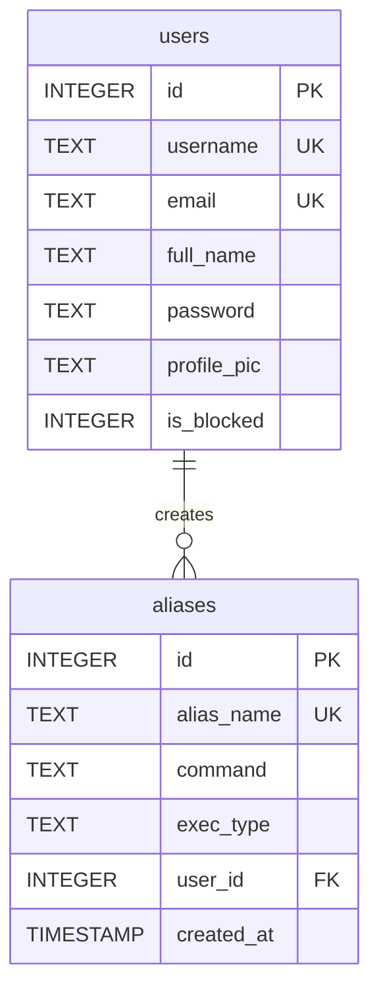

# Database Schema (SQLite)

The NeoArc Web Server uses a SQLite database with WAL mode, foreign keys enabled, and a 5000ms busy timeout.

## Database Connection

Every call to `get_db()` opens a fresh connection and sets per-connection PRAGMAs (not globally cached):

```python
conn = sqlite3.connect(config.DB_PATH, check_same_thread=False)
conn.row_factory = sqlite3.Row
conn.execute("PRAGMA journal_mode=WAL")
conn.execute("PRAGMA foreign_keys=ON")
conn.execute("PRAGMA busy_timeout=5000")
```

Connections are scoped to the Flask application context via `g` (managed by `core/helpers.py`'s `get_conn()`).

A `retry_on_locked` decorator retries operations up to 3 times with exponential backoff when encountering "database is locked" errors.

## Tables

### `users`

| Column | Type | Constraints | Description |
|---|---|---|---|
| `id` | INTEGER | PRIMARY KEY, AUTOINCREMENT | Unique user identifier |
| `username` | TEXT | UNIQUE | Username for login |
| `email` | TEXT | UNIQUE | Email address |
| `full_name` | TEXT | | User's full name |
| `password` | TEXT | | Hashed password (Werkzeug) |
| `profile_pic` | TEXT | | Filename in `static/uploads/` |
| `is_blocked` | INTEGER | DEFAULT 0 | Blocked flag (0=active, 1=blocked) |

### `aliases`

| Column | Type | Constraints | Description |
|---|---|---|---|
| `id` | INTEGER | PRIMARY KEY, AUTOINCREMENT | Unique alias identifier |
| `alias_name` | TEXT | UNIQUE | Name used to invoke via CLI |
| `command` | TEXT | | The script or command to execute |
| `exec_type` | TEXT | | Interpreter (bash, powershell, python, go, cmd, etc.) |
| `user_id` | INTEGER | | Foreign key to `users.id` |
| `created_at` | TIMESTAMP | DEFAULT CURRENT_TIMESTAMP | Auto-set on creation |

## Indexes

| Index Name | Table | Column(s) |
|---|---|---|
| `idx_aliases_alias_name` | aliases | alias_name |
| `idx_aliases_user_id` | aliases | user_id |
| `idx_users_username` | users | username |
| `idx_users_email` | users | email |

## Entity-Relationship Diagram



Written by [Neorwc](https://github.com/rkriad585/neorwc-cli), Created by RK Riad Khan
