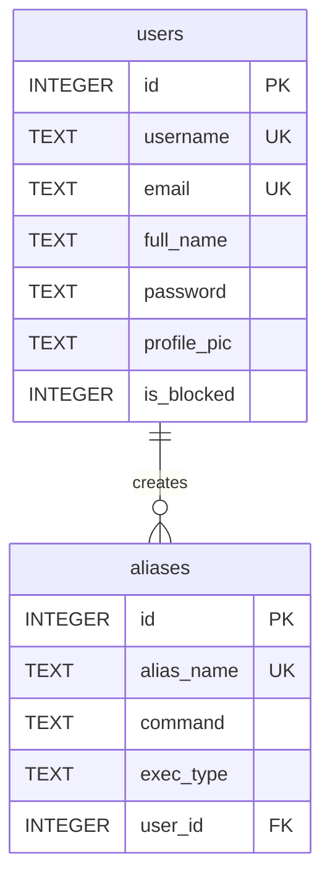

# Database Schema (SQLite3)

The NeoArc Web Server uses a simple SQLite3 database (`neoarc.db`) to store all persistent application data. The database schema consists of two main tables: `users` and `aliases`.

## Database Initialization

The `core/db.py` module handles the creation of these tables if they do not already exist when the Flask application starts.

```python
# core/db.py
def init_db():
    conn = get_db()
    conn.execute('''CREATE TABLE IF NOT EXISTS users (
                        id INTEGER PRIMARY KEY AUTOINCREMENT, 
                        username TEXT UNIQUE, 
                        email TEXT UNIQUE,
                        full_name TEXT,
                        password TEXT,
                        profile_pic TEXT,
                        is_blocked INTEGER DEFAULT 0)
                 ''')
    conn.execute('''CREATE TABLE IF NOT EXISTS aliases (
                        id INTEGER PRIMARY KEY AUTOINCREMENT, 
                        alias_name TEXT UNIQUE, 
                        command TEXT, 
                        exec_type TEXT, 
                        user_id INTEGER)''')
    conn.commit()
    conn.close()
```

## Table Descriptions

### 1. `users` Table

Stores information about registered users of the NeoArc system.

| Column Name | Type    | Constraints               | Description                                     |
| :---------- | :------ | :------------------------ | :---------------------------------------------- |
| `id`        | INTEGER | PRIMARY KEY, AUTOINCREMENT | Unique identifier for the user.                 |
| `username`  | TEXT    | UNIQUE                    | Unique username for login and display.          |
| `email`     | TEXT    | UNIQUE                    | Unique email address for the user.              |
| `full_name` | TEXT    |                           | User's full name.                               |
| `password`  | TEXT    |                           | Hashed password for security.                   |
| `profile_pic` | TEXT  |                           | Filename of the user's profile picture (stored in `static/uploads`). |
| `is_blocked` | INTEGER | DEFAULT 0                 | Flag indicating if the user is blocked (0=active, 1=blocked). |

### 2. `aliases` Table

Stores the command aliases created by users.

| Column Name | Type    | Constraints               | Description                                     |
| :---------- | :------ | :------------------------ | :---------------------------------------------- |
| `id`        | INTEGER | PRIMARY KEY, AUTOINCREMENT | Unique identifier for the alias.                |
| `alias_name` | TEXT   | UNIQUE                    | The unique name used to invoke the alias via CLI. |
| `command`   | TEXT    |                           | The actual script or command to be executed.    |
| `exec_type` | TEXT    |                           | The type of interpreter needed (e.g., 'bash', 'powershell', 'python', 'go', 'cmd'). |
| `user_id`   | INTEGER |                           | Foreign key referencing the `id` of the `users` table, indicating the alias creator. |

## Entity-Relationship Diagram



This schema provides a robust foundation for managing user accounts and their associated command aliases within the NeoArc ecosystem.

Written by [Neorwc](https://github.com/rkriad585/neorwc-cli), Created by RK Riad Khan